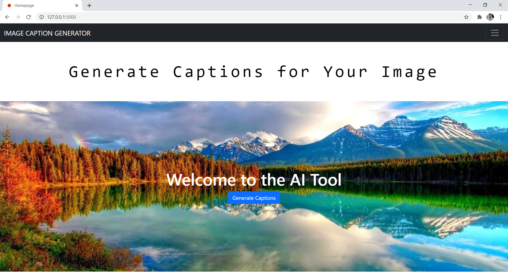
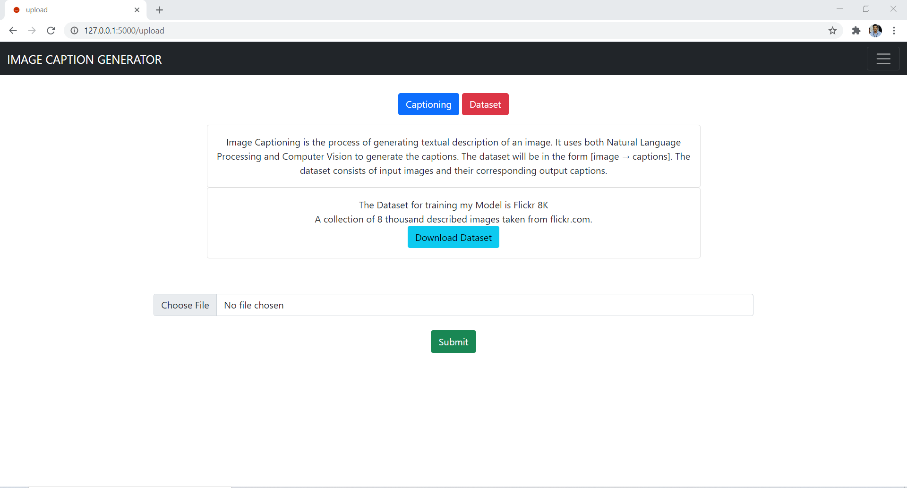
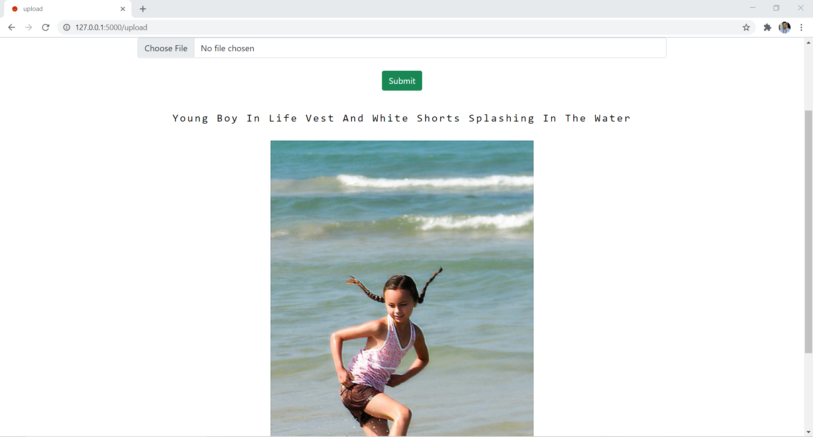
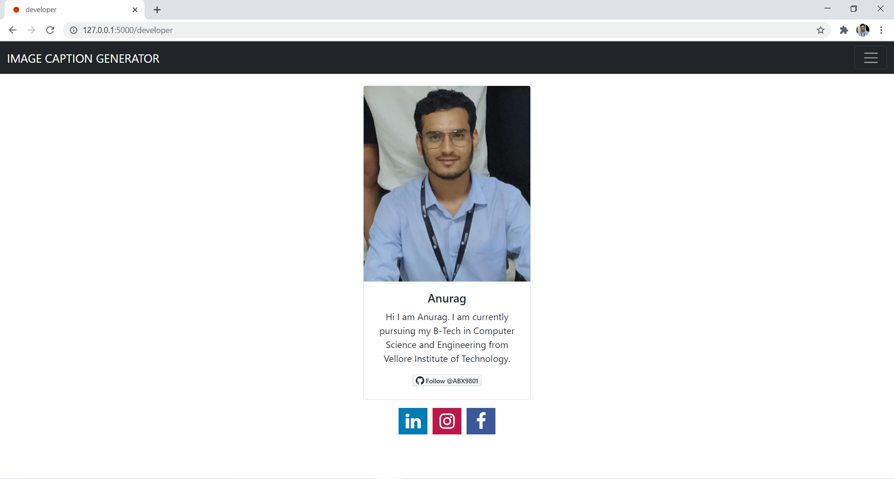

# Image-Caption-Generator
A Web App to generate caption for Images. VGG-16 Model is used to encode the images and extracting features and LSTM's will be used for training captions.

## Model


## Screenshots of the flask App
- homepage


- application page


- output


- developer page


## Video Demo


## How to run the project
- Install python 3 (3.7 or higher) and add python to path
- Clone the repository using cmd or bash:
```shell
git clone https://github.com/ABX9801/Book-Review-Website.git
```
- Install requirements using cmd or bash:
```shell
pip install -r requirements.txt
```
- Run the server in using cmd or bash:
```shell
flask run
```
- You will get a link in bash or cmd like http://127.0.0.1:5000/
- The website will run on this link

<p align="center">
  
</p>
